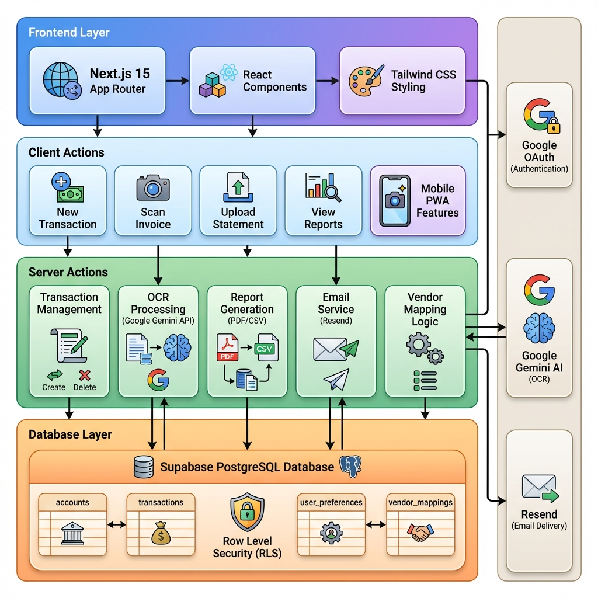

# 💰 FinanceHub

A professional double-entry accounting system with AI-powered invoice scanning, automated categorization, and comprehensive financial reporting.

   

## 🏗️ Architecture



The application follows a modern serverless architecture:
- **Frontend**: Next.js 15 with React Server Components and Client Components
- **Backend**: Next.js Server Actions for type-safe API calls
- **Database**: Supabase PostgreSQL with Row Level Security
- **External Services**: Google OAuth, Gemini AI, Resend Email


## ✨ Features

### 📊 Core Accounting
- **Double-Entry Ledger**: Professional accounting with automatic balance validation
- **Transaction Management**: Create, edit, and delete transactions with full audit trail
- **Chart of Accounts**: Pre-configured accounts (Income, Expense, Asset, Liability)
- **Financial Reports**: Date-range filtering, CSV/PDF export, email delivery

### 🤖 AI-Powered Automation
- **Smart Invoice Scanning**: Upload photos or PDFs → Auto-extract date, vendor, amount (Google Gemini)
- **Vendor Auto-Categorization**: Map vendor names to categories (e.g., "Walmart" → "Groceries")
- **Statement Import**: Parse CSV/PDF bank statements with column mapping

### 📱 Modern UX
- **Mobile-First**: Responsive design, PWA-ready, camera integration for invoice scanning
- **Real-Time Dashboard**: Live metrics (Income, Expenses, Net Profit)
- **Email Reports**: Send financial reports with attachments via Resend
- **Timezone Support**: User-configurable timezone for accurate transaction dates

## 🚀 Quick Start

### Prerequisites
- Node.js 18+
- Supabase account
- Google Cloud API Key (for Gemini OCR)
- Resend API Key (optional, for email reports)

### 1. Clone & Install
```bash
git clone https://github.com/nithindd/financehub.git
cd financehub
npm install
```

### 2. Environment Setup
Create `.env.local`:
```env
NEXT_PUBLIC_SUPABASE_URL=your_supabase_url
NEXT_PUBLIC_SUPABASE_ANON_KEY=your_supabase_anon_key
GOOGLE_API_KEY=your_gemini_api_key
RESEND_API_KEY=your_resend_api_key  # Optional
EMAIL_FROM="FinanceHub <accounting@yourdomain.com>"  # Optional
```

### 3. Database Setup
Run migrations in Supabase SQL Editor:
```sql
-- 1. Run schema.sql (accounts, transactions, journal_entries)
-- 2. Run migrations/003_user_preferences.sql
-- 3. Run migrations/004_vendor_mappings.sql
```

### 4. Configure Google OAuth
1. **Supabase**: Enable Google OAuth provider
2. **Google Cloud Console**: 
   - Create OAuth 2.0 credentials
   - Add redirect URI: `https://your-project.supabase.co/auth/v1/callback`

### 5. Run Development Server
```bash
npm run dev
```
Visit `http://localhost:3000`

## 📖 Usage Guide

### Creating Transactions
1. **Manual Entry**: Click "New Transaction" → Add journal entries → Ensure debits = credits
2. **Invoice Scan**: Click "Scan Invoice" → Upload photo/PDF → Review auto-filled data
3. **Statement Import**: Click "Upload Statement" → Upload CSV/PDF → Map columns → Import

### Managing Categories
1. Go to **Profile → Manage Categories**
2. View accounts grouped by type (Income, Expense, Asset, Liability)

### Vendor Auto-Mapping
1. Go to **Profile → Vendor Mappings**
2. Add mapping: `walmart` → `Groceries`
3. Future invoices from Walmart will auto-categorize to Groceries

### Editing/Deleting Transactions
1. Go to **View Reports**
2. Click ✏️ (Edit) or 🗑️ (Delete) on any transaction

### Email Reports
1. Go to **View Reports** → Filter by date
2. Click **Email Report**
3. Select attachments (CSV, PDF, Receipts)
4. Send to yourself or accountant

## 🛠️ Tech Stack

| Layer | Technology |
|-------|-----------|
| **Framework** | Next.js 15 (App Router) |
| **Language** | TypeScript |
| **Database** | Supabase (PostgreSQL) |
| **Auth** | Supabase Auth (Google OAuth) |
| **AI** | Google Gemini (Invoice OCR) |
| **Email** | Resend |
| **Styling** | Tailwind CSS v4 |
| **UI Components** | Shadcn UI |
| **PDF Parsing** | pdf-parse, jsPDF |
| **CSV Parsing** | PapaParse |

## 📁 Project Structure

```
financehub/
├── src/
│   ├── actions/          # Server actions (transactions, reports, OCR, vendors)
│   ├── app/              # Next.js App Router pages
│   │   ├── profile/      # User settings, timezone, vendor mappings
│   │   ├── reports/      # Financial reports, edit transactions
│   │   └── settings/     # Categories, vendor management
│   ├── components/
│   │   ├── reports/      # Report filters, summary, table, email dialog
│   │   ├── settings/     # Vendor mappings UI
│   │   └── ui/           # Shadcn UI components
│   ├── lib/              # Utilities (PDF parser, utils)
│   └── utils/            # Supabase client
├── migrations/           # Database migrations
└── public/               # Static assets
```

## 🔐 Security

- **Row Level Security (RLS)**: All database tables enforce user-level access
- **Server Actions**: All mutations run server-side with authentication checks
- **OAuth**: Secure Google authentication via Supabase
- **Environment Variables**: Sensitive keys stored in `.env.local` (gitignored)

## 🚢 Deployment

### Vercel (Recommended)
1. Push code to GitHub
2. Import project in Vercel
3. Add environment variables
4. Deploy
5. Update Supabase/Google OAuth redirect URIs with Vercel URL

See [deployment.md](./deployment.md) for detailed instructions.

## 📝 Database Schema

### Core Tables
- `accounts`: Chart of accounts (Income, Expense, Asset, Liability)
- `transactions`: Transaction headers (date, description, user)
- `journal_entries`: Double-entry splits (debit/credit, amount, account)
- `user_preferences`: Timezone settings
- `vendor_mappings`: Vendor-to-category auto-categorization rules

## 🤝 Contributing

1. Fork the repository
2. Create a feature branch (`git checkout -b feature/amazing-feature`)
3. Commit changes (`git commit -m 'Add amazing feature'`)
4. Push to branch (`git push origin feature/amazing-feature`)
5. Open a Pull Request

## 📄 License

MIT License - see [LICENSE](LICENSE) for details

## 🙏 Acknowledgments

- [Next.js](https://nextjs.org/) - React framework
- [Supabase](https://supabase.com/) - Backend as a Service
- [Google Gemini](https://ai.google.dev/) - AI-powered OCR
- [Shadcn UI](https://ui.shadcn.com/) - Component library
- [Resend](https://resend.com/) - Email delivery

---

**Built with ❤️ using Next.js, Supabase, and AI**
